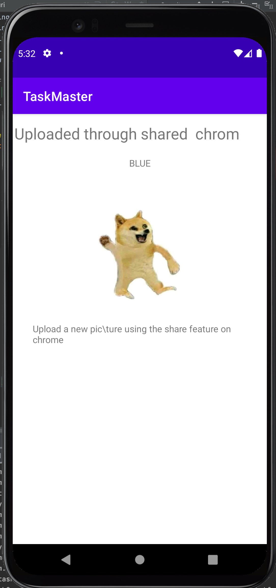

# Taskmaster

## APK

- [APP APK](app-debug.apk)

## LAB 26: Beginning TaskMaster

### Featured Tasks

#### Homepage

- The main page should be built out to match the wireframe. In particular, it should have a heading at the top of the page, an image to mock the “my tasks” view, and buttons at the bottom of the page to allow going to the “add tasks” and “all tasks” page.

#### Add a Task

- On the “Add a Task” page, allow users to type in details about a new task, specifically a title and a body. When users click the “submit” button, show a “submitted!” label on the page.

#### All Tasks

- The all tasks page should just be an image with a back button; it needs no functionality.

### Screenshots

#### Home

##### Add Task Activity

#### Add Task Submitted Button

#### All Tasks Activity

## LAB 27: Data in TaskMaster

### Featured Tasks

#### Task Detail Page

- Create a Task Detail page. It should have a title at the top of the page, and a Lorem Ipsum description.

#### Settings Page

- Create a Settings page. It should allow users to enter their username and hit save.

#### Homepage

- The main page should be modified to contain three different buttons with hardcoded task titles. When a user taps one of the titles, it should go to the Task Detail page, and the title at the top of the page should match the task title that was tapped on the previous page.

- The homepage should also contain a button to visit the Settings page, and once the user has entered their username, it should display “{username}’s tasks” above the three task buttons.

## LAB 28: RecyclerView

### Featured Tasks

#### Task Model

- Create a Task class. A Task should have a title, a body, and a state. The state should be one of “new”, “assigned”, “in progress”, or “complete”.

#### Homepage

- Refactor your homepage to use a RecyclerView for displaying Task data. This should have hardcoded Task data for now.

- Some steps you will likely want to take to accomplish this:
  - Create a ViewAdapter class that displays data from a list of Tasks.
  - In your MainActivity, create at least three hardcoded Task instances and use those to populate your RecyclerView/ViewAdapter.
- Ensure that you can tap on any one of the Tasks in the RecyclerView, and it will appropriately launch the detail page with the correct Task title displayed.

### Screenshots

#### Task Detail Page

#### Settings Page

#### Homepage

#### Task List Display

#### Recycler View Task Page

## LAB 29: Room

### Feature Tasks

#### Task Model and Room

- Following the directions provided in the Android documentation, set up Room in your application, and modify your Task class to be an Entity.

#### Add Task Form

- Modify your Add Task form to save the data entered in as a Task in your local database.

#### Homepage

- Refactor your homepage’s RecyclerView to display all Task entities in your database.

#### Detail Page

- Ensure that the description and status of a tapped task are also displayed on the detail page, in addition to the title. (Note that you can accomplish this by passing along the entire Task entity, or by passing along only its ID in the intent.)

## LAB 32: Amplify and DynamoDB

### Feature Tasks

- Using the amplify add api command, create a Task resource that replicates our existing Task schema. Update all references to the Task data to instead use AWS Amplify to access your data in DynamoDB instead of in Room.

#### Add Task Form

- Modify your Add Task form to save the data entered in as a Task to DynamoDB.

#### Homepage

- Refactor your homepage’s RecyclerView to display all Task entities in DynamoDB.

## LAB 33: Amplify and DynamoDB

### Feature Tasks

#### Tasks Are Owned By Teams

-  Create a second entity for a team, which has a name and a list of tasks. Update your tasks to be owned by a team.
- Manually create three teams by running a mutation exactly three times in your code. (You do NOT need to allow the user to create new teams.)

#### Add Task Form

- Modify your Add Task form to include either a Spinner or Radio Buttons for which team that task belongs to.

#### Settings Page

- In addition to a username, allow the user to choose their team on the Settings page. Use that Team to display only that team’s tasks on the homepage.

### Screenshots

#### Add Task Team

#### Settings

## LAB 34: Publishing to the Play Store

### Feature Tasks

#### App Polish

- Ensure that your application follows Google’s guidelines.

#### Build Final APK

- Build an APK for your application. Include that APK in your GitHub repo.

## LAB 36: Publishing to the Play Store

### Feature Tasks

#### User Login

- Add Cognito to your Amplify setup. Add in user login and sign up flows to your application, using Cognito’s pre-built UI as appropriate. Display the logged in user’s username somewhere relevant in your app.

#### User Logout

- Allow users to log out of your application.

### Screenshots

#### Login

#### Signup

#### Verify Activity

#### Username Display

## LAB 37: S3

### Feature Tasks

#### User Login

- On the “Add a Task” activity, allow users to optionally select a file to attach to that task. If a user attaches a file to a task, that file should be uploaded to S3, and associated with that task.

#### Displaying Files

- On the Task detail activity, if there is a file that is an image associated with a particular Task, that image should be displayed within that activity. (If the file is any other type, you should display a link to it.)

### Screenshots

#### Task Detail

## LAB 38: Intent Filter

### Feature Tasks

#### Adding a Task from Another Application

- Add an intent filter to your application such that a user can hit the “share” button on an image in another application, choose TaskMaster as the app to share that image with, and be taken directly to the Add a Task activity with that image pre-selected.

### Screenshots

#### Google Image

#### Share

#### Image Preview

#### Updated List

#### Details

## Changelog

- [11/2/2021] Removed rooms and implemented AWS Amplify and DynamoDB
- [11/2/2021] Enum is not working at the moment
- [11/3/2021] Enum is working
- [11/3/2021] Implemented a 'Team' model to database / rooms to create relationships between 'Task Item' and 'Team'
- [11/3/2021] Added spinners for team selection and task status
- [11/3/2021] Added spinner for the Settings Page to filter through and display tasks of the selected Team
- [11/8/2021] Added auth via Cognito
- [11/8/2021] Features implemented: Sign in, Sign up, Logout, Verify
- [11/9/2021] Implemented selction with Andriod file picker
- [11/9/2021] Implemented ability to upload selected image to s3 bucket after choosing saving task
- [11/9/2021] Image is displayed on the task detail activity
- [11/10/2021] Added intent filter to application allows user to 'share' an image and open the taskmaster app
- [11/10/2021] Displays a preview of image to be uploaded